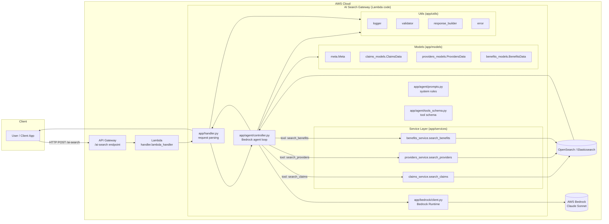

## Architecture Diagram

This diagram shows the full path from **client query** → **Lambda** → **Bedrock‑driven tool orchestration** → **OpenSearch domain services** → **governed JSON response** back to the caller.

